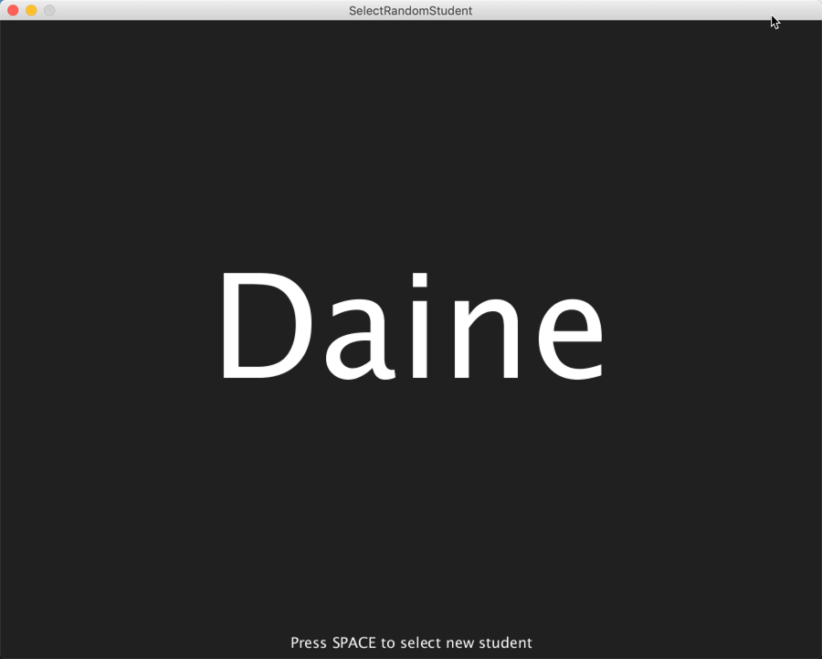
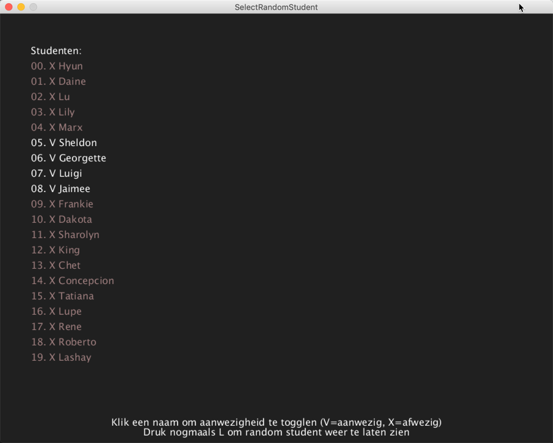

# Select random student
Deze applicatie is opgesteld door HAN-ICA docent Sander Leer om tijdens een les makkelijk en eerlijk een willekeurige student uit te kiezen om een vraag te stellen of een opgave uit diens huiswerk te bespreken.

De applicatie is geschreven in Processing, een van Java afgeleidde taal met een eigen ontwikkelomgeving (IDE) en inclusief direct grafische library om studenten te leren programmeren door snel visueels in elkaar te zetten (tekening of animatie). Processing gebruiken we in de course SPD - Structured Program Development bij de Informatica en Communicatie Academie (ICA) van de Hogeschool Arnhem en Nijmegen (HAN).

## Hoe gebruik ik dit/start ik dit op?

Download processing 3.x van de website - https://processing.org/download/ - en start hierin de SelectRandomStudent. De applicatie is getest in Processing v3.5.3. In het bestand `studenten.txt` vul je de namen in van je huidige klas. In principe de voornamen, in geval 1 naam vaker voorkomt kort onderscheid; bijvoorbeeld `Henk B.` en `Henk H.`. Het programma kent enkele toetsen voor de bediening en legt zichzelf on-screen uit. NB: Voorkom dat je echte studentnamen incheckt in git, zie opmerking hierover onderaan.

Het aanwezig zijn in een folder met naam `SelectRandomStudent` is een eis van Processing. De andere bestanden in de folder opent Processing dan direct in eigen tabs. Zo heeft Processing nog wat meer constraints, maar er is bewust gekozen niet over te gaan naar een Java variant om die extra complexiteit te vermijden ([KISS]()).

## Waarom op GitHub?
Om nieuwsgierige studenten in staat te stellen de broncode van de applicatie te bekijken. Om te controleren dat deze inderdaad echt eerlijk is. Ook een mooie introductie in open source software, en ook social coding.

## Features

- [x] Selecteer random student
- [x] Lees de student namen in vanuit een .txt bestand
- [x] Markeer afwezige studenten en zorg dat ze niet opnieuw geselecteerd worden
- [x] Toon lijst van studenten en markeer hierin afwezigheid meerdere studenten tegelijkertijd

## Wanted
- [ ] Ondersteun meerdere klassen via bijvoorbeeld meerdere tekstbestanden
- [ ] Integratie met iSAS voor studentnamen en/of aanwezigheid :smile
- [ ] ... (zie GitHub issues)

## Kan ik zelf bijdragen of feature requests doen?
Jazeker. Maak een issue aan, clone naar lokaal of fork it. Op een clean SOLID manier natuurlijk :). Een CONTRIBUTE.md komt wellicht tzt.

## Check NIET studenten namen in; denk aan de AVG
NB Deze repo bevat een test bestand met studentennamen in `studenten.txt` (dank aan [listofrandomnames.com/](http://listofrandomnames.com/)). Als jeze versie ook gebruikt in je les en met echte studenten namen vult, zorg dan dat je deze NIET incheckt hier op github!

Het makkelijkst is om git zo in te stellen dat het lokale wijzigingen in dit bestand negeert, met het volgende commando:

`git update-index --skip-worktree SelectRandomStudent/studenten.txt`

Helaas moet elke developer dit apart doen ([bron](http://blog.stephan-partzsch.de/how-to-ignore-changes-in-tracked-files-with-git/)).
